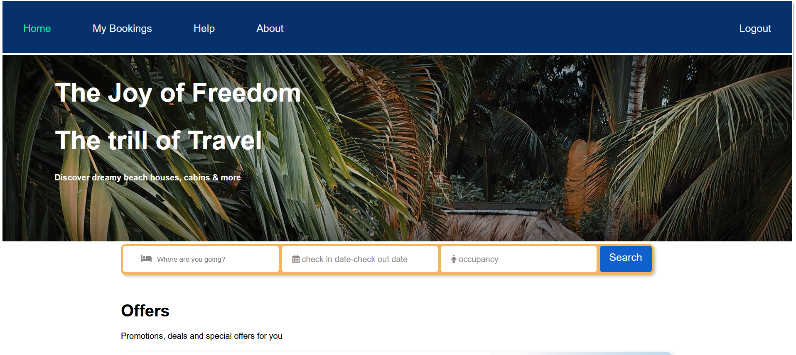
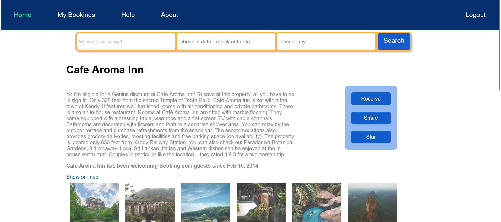
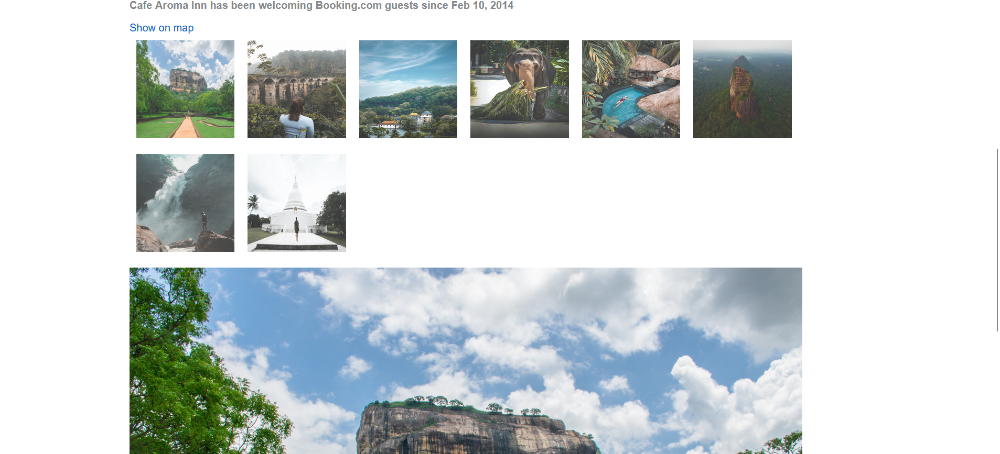
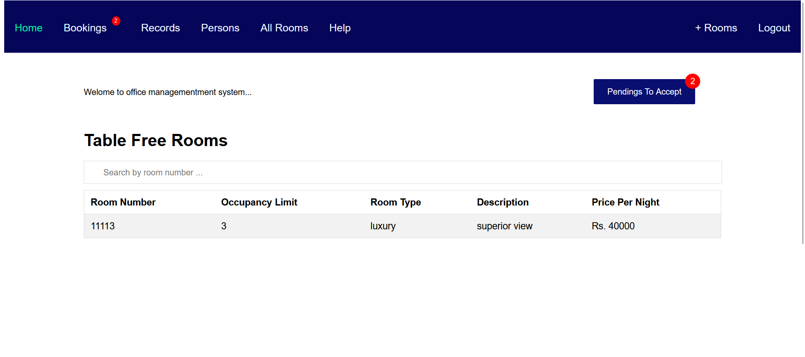
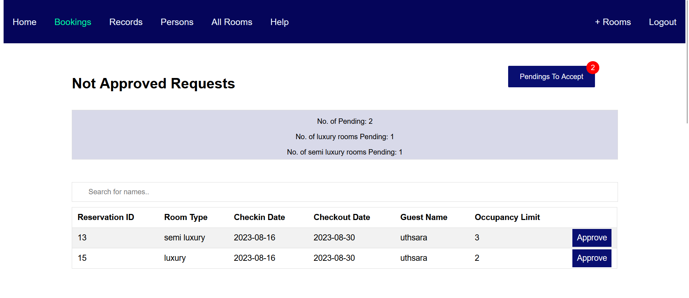
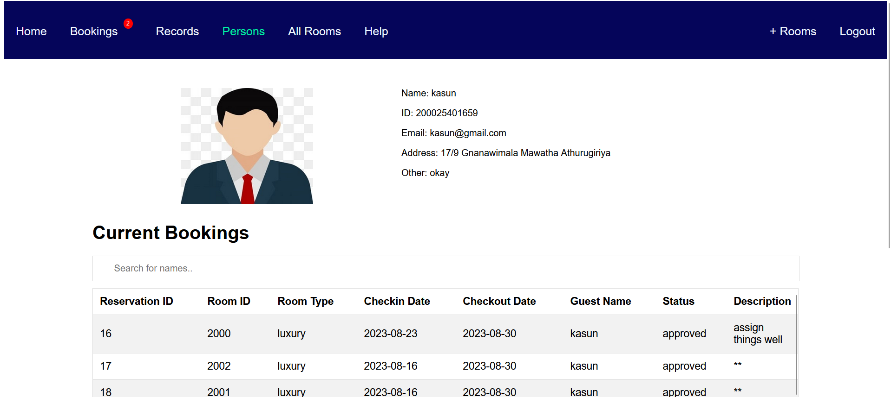

# Hotel Reservation System

The tech-stack used here is HTML, CSS, JS, PHP, and MYSQL for database
A hotel reservation system where a customer can search for the hotel, see details, suggestions, discouts, then book the relavant hotel.
After booking he will be able to get a receipt for the bookings and get details of current bookings

## Screenshots

Main Page

## Features

- Full web page for user interface till the customer books; made with completely simple html
- Full web page for the officer that will give all the new bookings, messagesbookings history, records of customers etc.
- Abilty to change and use in any hotel reservation system

## Installation

1. Home page for customer_ui is -->loggedout-->index.html
2. Home page for officer_ui is -->index.html
3. change the database credentials before use
4. Have to create the relevat Tables with exact names in your Database For the proper functioning

## Usage

Initially in officer_ui signup for the hotel, next signup as a officer in that hotel, next you can add all the rooms in your hotel.
Next in customer_ui you can book the relevant hotel You signed up and see whether it is shown in the officer_ui as pending to approve.

## Contributing

All volunteering Contributions for this project are accepted, please read everyting and send your suggestions so that whould be helpful to anyone.

## License

The project is open source.

---
Feel free to reach out at [uthsaraiw@gmail.com](mailto:uthsaraiw@gmail.com) for any questions.
